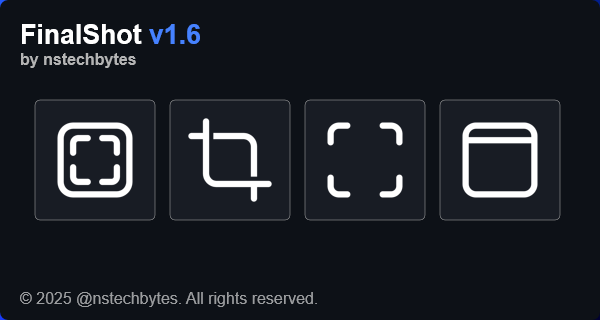
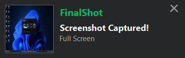
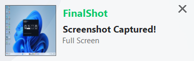

# FinalShot

A powerful Rainmeter plugin for capturing screenshots directly from your skins with beautiful themed notifications.  
FinalShot supports full‑screen captures, predefined regions, custom selection, window capture, multi‑monitor composition, cursor inclusion, JPEG quality control, and post‑capture actions.



### Toast Notifications

<table>
  <tr>
    <td></td>
    <td></td>
  </tr>
  <tr>
    <td align="center"><b>Dark Mode</b></td>
    <td align="center"><b>Light Mode</b></td>
  </tr>
</table>

---

## Features

- **Full‑Screen Capture** (`-fs`)  
  Capture the entire virtual screen (all monitors).

- **Predefined Region** (`-ps`)  
  Capture a fixed rectangle specified by X, Y, Width, and Height.

- **Custom Selection** (`-cs`)  
  Draw a region on‑the‑fly with your mouse.

- **Window Capture** (`-ws|windowtitle`)  
  Capture a specific window by its exact title.  
  Supports two modes: exclusive window capture (using `PrintWindow` API) or screen-based capture (includes overlapping windows).

- **Toast Notifications**  
  Beautiful themed notifications that adapt to Windows Dark/Light mode with screenshot preview.

- **Notification Sound**  
  Plays the Windows notification sound on successful capture.

- **Multi‑Monitor Composition**  
  Seamlessly stitch captures across multiple monitors.

- **Cursor Inclusion**  
  Optionally include the mouse cursor in your screenshots.

- **JPEG Quality Control**  
  Adjust JPEG compression quality (0–100).

- **Finish Actions**  
  Execute any Rainmeter bang or external command after saving.

- **Debug Logging**  
  Optional logging with automatic log rotation.

---

## Requirements

- Windows 7 or later  
- Rainmeter 4.x or later  
- .NET Framework 4.5 or higher  

---

## Installation

1. **Build** the plugin from source (or download the precompiled `FinalShot.dll`).  
2. Copy `FinalShot.dll` into your Rainmeter **Plugins** folder (e.g. `…\Rainmeter\Plugins\`).  
3. Edit your Rainmeter skin `.ini` to reference the plugin.

---

## Usage

### 1. Define a Measure

```ini
[MeasureScreenshot]
Measure=Plugin
Plugin=FinalShot
; Where to save the screenshot:
SavePath=C:\Users\You\Pictures\shot.png
; 1 = include cursor, 0 = no cursor
ShowCursor=1
; 1 = show notification with preview, 0 = no notification
ShowNotification=1
; Window capture mode (1 = exclusive window, 0 = screen-based)
UsePrintWindow=1
; JPEG quality (only if SavePath ends in .jpg/.jpeg)
JpgQuality=85
; Predefined region (for -ps):
PredefX=100
PredefY=100
PredefWidth=800
PredefHeight=600
; After saving, execute this bang or app:
ScreenshotFinishAction=[!Log "Screenshot taken!"]
; Enable debug logging (1 = on, 0 = off)
DebugLog=0
; (Optional) custom log path:
; DebugLogPath=C:\Temp\FinalShotDebug.log
```

### 2. Capture with Bangs

- **Full‑Screen**  
  ```ini
  [!CommandMeasure MeasureScreenshot "-fs"]
  ```

- **Predefined Region**  
  ```ini
  [!CommandMeasure MeasureScreenshot "-ps"]
  ```

- **Custom Selection**  
  ```ini
  [!CommandMeasure MeasureScreenshot "-cs"]
  ```

- **Window Capture**  
  ```ini
  [!CommandMeasure MeasureScreenshot "-ws|Notepad"]
  [!CommandMeasure MeasureScreenshot "-ws|Google Chrome"]
  ```
  Note: Window title must match exactly as shown in the title bar.

- **Batch Execution**  
  You can also call:
  ```ini
  [!CommandMeasure MeasureScreenshot "ExecuteBatch 1"]  ; full-screen
  [!CommandMeasure MeasureScreenshot "ExecuteBatch 2"]  ; custom
  [!CommandMeasure MeasureScreenshot "ExecuteBatch 3"]  ; predefined
  ```

---

## Settings Reference

| Setting                 | Description                                                                                     | Default     |
|-------------------------|-------------------------------------------------------------------------------------------------|-------------|
| `SavePath`              | Full path (including filename & extension) where the screenshot will be saved.                   | (empty)     |
| `ScreenshotFinishAction`| Rainmeter bang or command to run after saving.                                                   | (empty)     |
| `ShowCursor`            | Include mouse cursor in capture? (1 = yes, 0 = no)                                               | 0           |
| `ShowNotification`      | Show toast notification with preview after capture? (1 = yes, 0 = no)                           | 0           |
| `UsePrintWindow`        | Window capture mode: 1 = exclusive window (no overlaps), 0 = screen-based (includes overlaps)   | 0           |
| `JpgQuality`            | JPEG compression quality (0–100). Only applies to `.jpg` or `.jpeg` files.                        | 70          |
| `PredefX`, `PredefY`    | Top‑left coordinates of the predefined capture region.                                           | 0           |
| `PredefWidth`, `PredefHeight` | Width & height of the predefined capture region.                                            | 0           |
| `DebugLog`              | Enable debug logging? (1 = yes, 0 = no).                                                         | 0           |
| `DebugLogPath`          | Custom path for the debug log file (overrides default `FinalShotDebug.log`).                    | (empty)     |

---

## Examples

### Full Screen Capture with Notification
```ini
[MeasureFull]
Measure=Plugin
Plugin=FinalShot
SavePath=#@#Screenshots\Full.png
ShowCursor=1
ShowNotification=1
ScreenshotFinishAction=[!Refresh]
```

### Predefined Region Capture
```ini
[MeasureRegion]
Measure=Plugin
Plugin=FinalShot
SavePath=#@#Screenshots\Region.png
PredefX=200
PredefY=150
PredefWidth=1024
PredefHeight=768
ShowCursor=0
ShowNotification=1
```

### Window Capture (Exclusive Mode)
```ini
[MeasureWindow]
Measure=Plugin
Plugin=FinalShot
SavePath=#@#Screenshots\Window.png
ShowCursor=0
ShowNotification=1
; Capture only the window (no overlapping windows)
UsePrintWindow=1

[CaptureNotepad]
Meter=String
LeftMouseUpAction=[!CommandMeasure MeasureWindow "-ws|Untitled - Notepad"]
```

### Window Capture (Screen-Based Mode)
```ini
[MeasureWindowScreen]
Measure=Plugin
Plugin=FinalShot
SavePath=#@#Screenshots\WindowScreen.png
; Capture whatever is visible on screen (includes overlapping windows)
UsePrintWindow=0
```

---

## Debug Logging

To troubleshoot, enable `DebugLog=1`. Logs are written to `FinalShotDebug.log` (or your custom `DebugLogPath`) and automatically rotate at 5 MB.

---

## Building from Source

1. Open the solution in Visual Studio.  
2. Ensure your target framework is set to .NET Framework 4.5 or higher.  
3. Build in **Release** mode.  
4. Copy the resulting `FinalShot.dll` to your Rainmeter plugins folder.

---

## License

This project is licensed under the MIT License. See [LICENSE](LICENSE) for details.  
