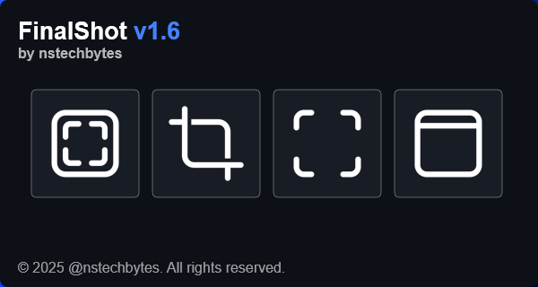
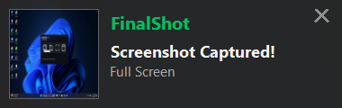
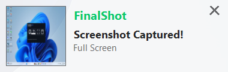

# FinalShot

A powerful Rainmeter plugin for capturing screenshots directly from your skins with beautiful themed notifications.  
FinalShot supports full‑screen captures, predefined regions, custom selection, smart window snapping, window capture, multi‑monitor composition, cursor inclusion, JPEG quality control, and post‑capture actions.



### Toast Notifications

<table>
  <tr>
    <td></td>
    <td></td>
  </tr>
  <tr>
    <td align="center"><b>Dark Mode</b></td>
    <td align="center"><b>Light Mode</b></td>
  </tr>
</table>

---

## Features

- **Full‑Screen Capture** (`-fs`)  
  Capture the entire virtual screen (all monitors).

- **Predefined Region** (`-ps`)  
  Capture a fixed rectangle specified by X, Y, Width, and Height.

- **Custom Selection with Smart Window Snap** (`-cs`)  
  Opens a full-screen overlay. Move your mouse to automatically highlight any window or control under the cursor — click to capture it instantly. Or drag anywhere on screen to define a free-selection rectangle. Both modes are available in the same overlay without switching.

- **Window Capture** (`-ws|windowtitle`)  
  Capture a specific window by its exact title.  
  Supports two modes: exclusive window capture (using `PrintWindow` API) or screen-based capture (includes overlapping windows).

- **Toast Notifications**  
  Beautiful themed notifications that adapt to Windows Dark/Light mode with screenshot preview.

- **Notification Sound**  
  Plays the Windows notification sound on successful capture.

- **Multi‑Monitor Composition**  
  Seamlessly stitch captures across multiple monitors.

- **Cursor Inclusion**  
  Optionally include the mouse cursor in your screenshots.

- **JPEG Quality Control**  
  Adjust JPEG compression quality (0–100).

- **Finish Actions**  
  Execute any Rainmeter bang or external command after saving.

- **Debug Logging**  
  Optional logging with automatic log rotation.

---

## Smart Window Snap

Smart Window Snap is the window-detection engine behind the `-cs` custom capture mode.  
When you trigger custom capture, FinalShot enumerates every visible window and child control on your desktop in the background. As you move the mouse, the region under the cursor is highlighted with a teal border and the surrounding area is dimmed — exactly like ShareX.

**How it works**

- The overlay opens immediately. Window enumeration runs on a background thread so the overlay never freezes.
- Move the cursor over any area — windows, panels, toolbars, sidebars, and individual controls are all detected.
- A teal border appears around the highlighted region. Everything outside is dimmed for clarity.
- **Click** on a highlighted region to capture it instantly.
- **Drag** anywhere on the overlay to draw a free-selection rectangle instead — the two modes coexist seamlessly.
- Move the mouse **more than 4 pixels** after pressing the button to switch from snap mode to free-drag mode automatically.
- **Right-click** or press **Esc** to cancel without capturing.

**What gets detected**

- All visible top-level application windows.
- Child controls inside windows — toolbars, sidebars, panels, list views, buttons, and more.
- The client area of each window as a separate snap target (useful for capturing content without the title bar).
- Controls like the Windows Explorer navigation pane, address bar, and file list are each independently detectable.

**Detection quality**

FinalShot uses DWM extended frame bounds (`DWMWA_EXTENDED_FRAME_BOUNDS`) for top-level window rectangles, which gives the visually rendered frame without invisible shadow pixels. Child controls are enumerated without the `IsWindowVisible` parent-chain restriction that would otherwise miss controls like Explorer's sidebar panels.

**Controlling detection from the skin**

| Setting          | Description                                                       | Default |
|------------------|-------------------------------------------------------------------|---------|
| `DetectWindows`  | Enable Smart Window Snap in custom capture mode. (1 = on, 0 = off) | 1       |
| `DetectControls` | Also detect child controls inside windows. (1 = on, 0 = off) Has no effect when `DetectWindows=0`. | 1       |

Set `DetectWindows=0` to revert to the original drag-only overlay with no window detection.  
Set `DetectControls=0` to detect top-level windows only, without snapping to individual panels or buttons.

---

## Requirements

- Windows 7 or later  
- Rainmeter 4.x or later  
- .NET Framework 4.5 or higher  

---

## Installation

1. **Build** the plugin from source (or download the precompiled `FinalShot.dll`).  
2. Copy `FinalShot.dll` into your Rainmeter **Plugins** folder (e.g. `…\Rainmeter\Plugins\`).  
3. Edit your Rainmeter skin `.ini` to reference the plugin.

---

## Usage

### 1. Define a Measure

```ini
[MeasureScreenshot]
Measure=Plugin
Plugin=FinalShot
; Where to save the screenshot:
SavePath=C:\Users\You\Pictures\shot.png
; 1 = include cursor, 0 = no cursor
ShowCursor=1
; 1 = show notification with preview, 0 = no notification
ShowNotification=1
; Window capture mode (1 = exclusive window, 0 = screen-based)
UsePrintWindow=1
; JPEG quality (only if SavePath ends in .jpg/.jpeg)
JpgQuality=85
; Predefined region (for -ps):
PredefX=100
PredefY=100
PredefWidth=800
PredefHeight=600
; After saving, execute this bang or app:
ScreenshotFinishAction=[!Log "Screenshot taken!"]
; Smart Window Snap (1 = on, 0 = drag-only mode):
DetectWindows=1
; Detect child controls such as sidebars and toolbars (1 = on, 0 = off):
DetectControls=1
; Enable debug logging (1 = on, 0 = off)
DebugLog=0
; (Optional) custom log path:
; DebugLogPath=C:\Temp\FinalShotDebug.log
```

### 2. Capture with Bangs

- **Full‑Screen**  
  ```ini
  [!CommandMeasure MeasureScreenshot "-fs"]
  ```

- **Predefined Region**  
  ```ini
  [!CommandMeasure MeasureScreenshot "-ps"]
  ```

- **Custom Selection / Smart Window Snap**  
  ```ini
  [!CommandMeasure MeasureScreenshot "-cs"]
  ```
  Opens the overlay. Hover to highlight a window or control and click to snap it,  
  or drag to draw a free-selection rectangle.

- **Window Capture**  
  ```ini
  [!CommandMeasure MeasureScreenshot "-ws|Notepad"]
  [!CommandMeasure MeasureScreenshot "-ws|Google Chrome"]
  ```
  Note: Window title must match exactly as shown in the title bar.

- **Batch Execution**  
  ```ini
  [!CommandMeasure MeasureScreenshot "ExecuteBatch 1"]  ; full-screen
  [!CommandMeasure MeasureScreenshot "ExecuteBatch 2"]  ; custom
  [!CommandMeasure MeasureScreenshot "ExecuteBatch 3"]  ; predefined
  ```

---

## Settings Reference

| Setting                       | Description                                                                                     | Default |
|-------------------------------|-------------------------------------------------------------------------------------------------|---------|
| `SavePath`                    | Full path (including filename & extension) where the screenshot will be saved.                  | (empty) |
| `ScreenshotFinishAction`      | Rainmeter bang or command to run after saving.                                                  | (empty) |
| `ShowCursor`                  | Include mouse cursor in capture? (1 = yes, 0 = no)                                             | 0       |
| `ShowNotification`            | Show toast notification with preview after capture? (1 = yes, 0 = no)                          | 0       |
| `UsePrintWindow`              | Window capture mode: 1 = exclusive window (no overlaps), 0 = screen-based (includes overlaps)  | 0       |
| `JpgQuality`                  | JPEG compression quality (0–100). Only applies to `.jpg` or `.jpeg` files.                     | 70      |
| `PredefX`, `PredefY`          | Top‑left coordinates of the predefined capture region.                                          | 0       |
| `PredefWidth`, `PredefHeight` | Width & height of the predefined capture region.                                                | 0       |
| `DetectWindows`               | Enable Smart Window Snap in custom capture mode. (1 = on, 0 = off)                             | 1       |
| `DetectControls`              | Detect child controls (toolbars, sidebars, panels) in addition to top-level windows. Has no effect when `DetectWindows=0`. | 1       |
| `DebugLog`                    | Enable debug logging? (1 = yes, 0 = no).                                                        | 0       |
| `DebugLogPath`                | Custom path for the debug log file (overrides default `FinalShotDebug.log`).                   | (empty) |

---

## Examples

### Full Screen Capture with Notification
```ini
[MeasureFull]
Measure=Plugin
Plugin=FinalShot
SavePath=#@#Screenshots\Full.png
ShowCursor=1
ShowNotification=1
ScreenshotFinishAction=[!Refresh]
```

### Predefined Region Capture
```ini
[MeasureRegion]
Measure=Plugin
Plugin=FinalShot
SavePath=#@#Screenshots\Region.png
PredefX=200
PredefY=150
PredefWidth=1024
PredefHeight=768
ShowCursor=0
ShowNotification=1
```

### Custom Capture — Smart Window Snap enabled (default)
```ini
[MeasureCustom]
Measure=Plugin
Plugin=FinalShot
SavePath=#@#Screenshots\Custom.png
ShowCursor=0
ShowNotification=1
DetectWindows=1
DetectControls=1

[ButtonCapture]
Meter=String
Text=Capture
LeftMouseUpAction=[!CommandMeasure MeasureCustom "-cs"]
```
Hover over any window or control in the overlay and click to snap it.  
Drag to fall back to free-selection at any time.

### Custom Capture — Drag-only (Smart Window Snap disabled)
```ini
[MeasureCustomDrag]
Measure=Plugin
Plugin=FinalShot
SavePath=#@#Screenshots\Custom.png
DetectWindows=0
```

### Window Capture (Exclusive Mode)
```ini
[MeasureWindow]
Measure=Plugin
Plugin=FinalShot
SavePath=#@#Screenshots\Window.png
ShowCursor=0
ShowNotification=1
UsePrintWindow=1

[CaptureNotepad]
Meter=String
LeftMouseUpAction=[!CommandMeasure MeasureWindow "-ws|Untitled - Notepad"]
```

### Window Capture (Screen-Based Mode)
```ini
[MeasureWindowScreen]
Measure=Plugin
Plugin=FinalShot
SavePath=#@#Screenshots\WindowScreen.png
UsePrintWindow=0
```

---

## Debug Logging

To troubleshoot, enable `DebugLog=1`. Logs are written to `FinalShotDebug.log` (or your custom `DebugLogPath`) and automatically rotate at 5 MB.

---

## Building from Source

1. Open the solution in Visual Studio.  
2. Ensure your target framework is set to .NET Framework 4.5 or higher.  
3. Build in **Release** mode.  
4. Copy the resulting `FinalShot.dll` to your Rainmeter plugins folder.

---

## License

This project is licensed under the MIT License. See [LICENSE](LICENSE) for details.
